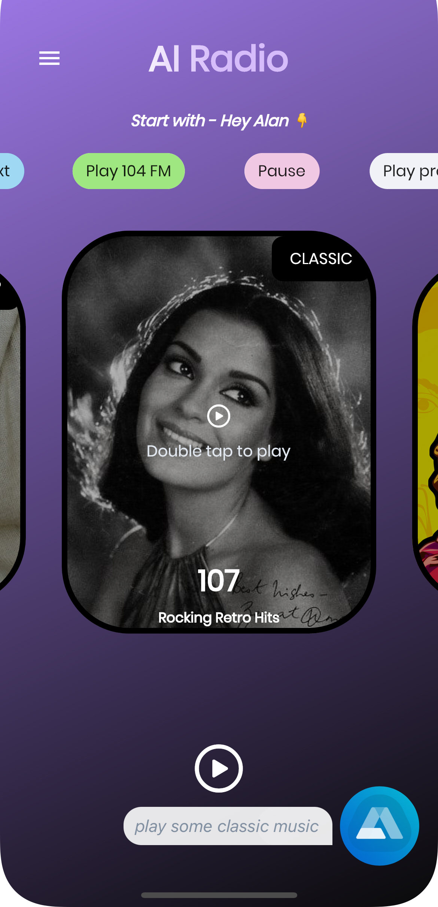
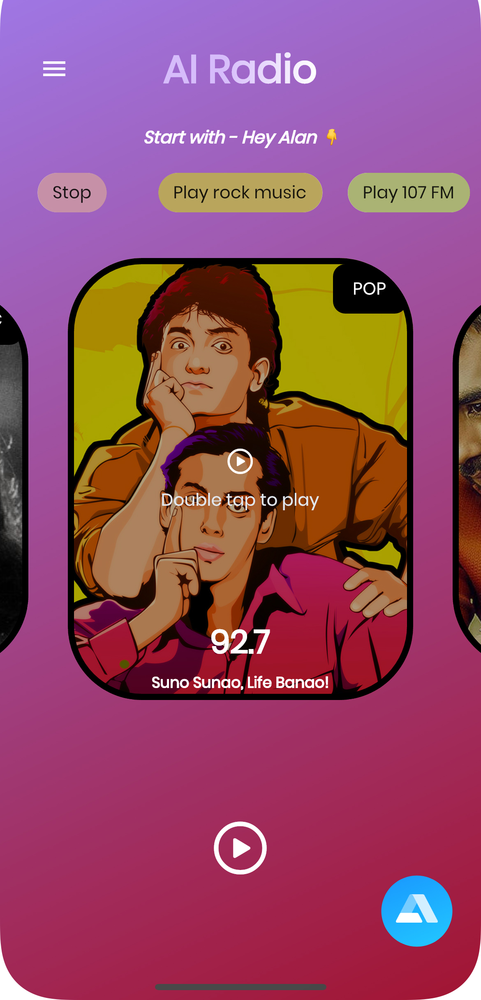
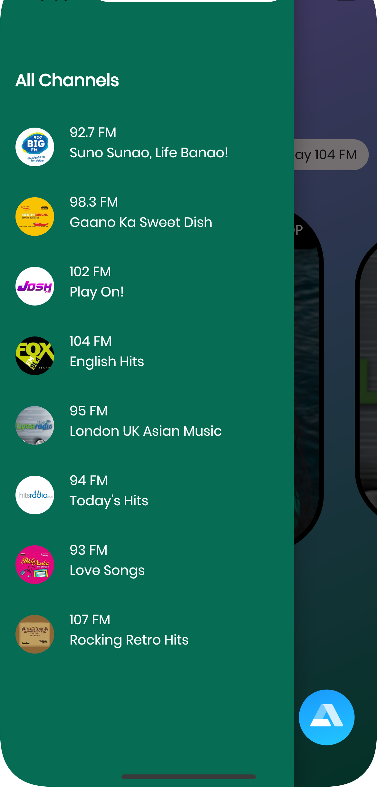
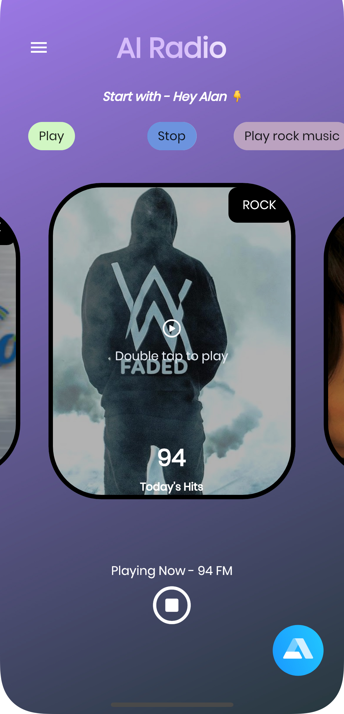

# AI-Powered Voice Assistant Flutter Radio App

This is a radio app empowered with AI where you can ask Alan to play some music.

<h1 align="center">

</h1>

## How to use?
- Just install the app on the device.
- Open the app and say "Hey Alan! Play some music" or any other sentence which include "play" word.
- It will automatically start playing the music.
- Also to stop the music, just use the word "stop" in your sentence while giving command.

## Techinical Details
- Build in Flutter 2.13.0.
- Uses AI(Artificial Intelligence) to detect the command given.
- Vx library is used to design the whole UI, which makes the work very much easy.
- Various newly added widgets in Flutter 2.13.0 are also used.

## Some screenshots

|                                      |                                      |
| ------------------------------------ | ------------------------------------ |
|  |  |
|   |   |

---

